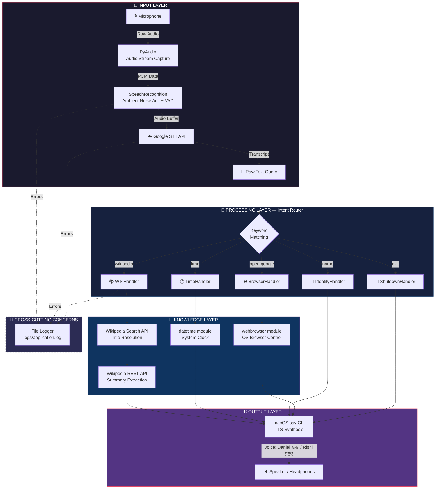
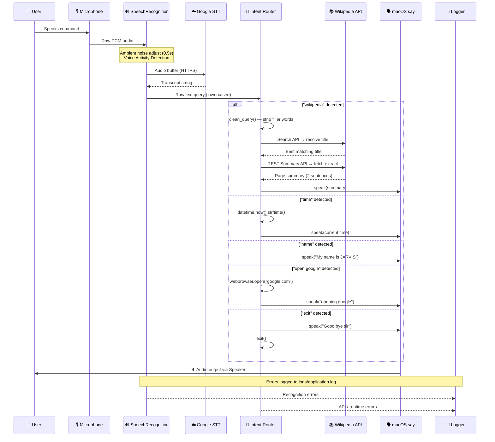

<div align="center">

# 🤖 JARVIS — AI Voice Assistant

### *Just A Rather Very Intelligent System*

[](https://www.python.org/)
[](https://www.apple.com/macos/)
[](LICENSE)
[]()

> A lightweight, offline-first AI voice assistant for macOS — built with Python.  
> Inspired by Iron Man's JARVIS. Designed for real-time voice interaction.

</div>

---

## 📌 Table of Contents

- [Overview](#-overview)
- [System Architecture](#-system-architecture)
- [Module Breakdown](#-module-breakdown)
- [Data Flow](#-data-flow)
- [Features](#-features)
- [Tech Stack & Design Decisions](#-tech-stack--design-decisions)
- [Project Structure](#-project-structure)
- [Setup & Installation](#-setup--installation)
- [Usage](#-usage)
- [API Integrations](#-api-integrations)
- [Logging & Error Handling](#-logging--error-handling)
- [Troubleshooting](#-troubleshooting)
- [Roadmap](#-roadmap)
- [Author](#-author)

---

## 🧠 Overview

JARVIS is a **real-time voice assistant** that operates in a continuous **listen → understand → respond** loop. It uses:

- **Google Speech-to-Text** for voice recognition (cloud, via `SpeechRecognition`)
- **macOS native `say` CLI** for text-to-speech (offline, no API cost)
- **Wikipedia REST API** for knowledge queries (no third-party library)
- **Python standard library** for time, browser control, and logging

The system is designed to be **modular**, **lightweight**, and **easily extensible** — new intents can be added as simple `elif` branches or as separate handler functions.

---

## 🏗 System Architecture



---

## 📦 Module Breakdown

| Module / Function | Responsibility | External Dependency |
|---|---|---|
| `get_voice()` | Probes macOS `say -v ?` to auto-select the best voice | None (subprocess) |
| `speak(text)` | Converts text → audio via `say` CLI, blocks until done | macOS `say` |
| `takeCommand()` | Captures mic audio, sends to Google STT, returns text | `SpeechRecognition`, `PyAudio`, Google API |
| `wish_me()` | Greets user with time-appropriate message | None |
| `clean_query(text)` | Strips filler phrases before passing to Wikipedia | None |
| `wiki_summary(topic)` | 2-step Wikipedia lookup: search → summary | `requests`, Wikipedia REST API |
| **Intent Router** | `while True` loop — routes query to correct handler | All above |

---

## 🔄 Data Flow



---

## ✨ Features

| Voice Command | Action |
|---|---|
| `"what is your name"` | JARVIS introduces itself |
| `"what is the time"` | Reads current time aloud |
| `"open google"` | Opens browser to Google |
| `"[topic] according to wikipedia"` | Fetches & reads Wikipedia summary |
| `"who is [person]"` | Wikipedia person lookup |
| `"what is [topic]"` | Wikipedia topic lookup |
| `"exit"` / `"quit"` | Gracefully shuts down |

**Smart Capabilities:**
- 🕐 **Context-aware greeting** — Morning / Afternoon / Evening
- 🔇 **Ambient noise cancellation** — auto-adjusts before every listen
- 🧹 **Query cleaning** — removes filler words before Wikipedia search
- 🔁 **Continuous loop** — always listening, never stops until you say exit
- 📝 **Persistent logging** — all errors saved to `logs/application.log`

---

## ⚡ Tech Stack & Design Decisions

### Why `subprocess` + macOS `say` instead of `pyttsx3`?

| Factor | `pyttsx3` | `macOS say` |
|---|---|---|
| Quality | Robotic, low quality | Native, high quality |
| Latency | Moderate | Low |
| Dependencies | Needs system drivers | Zero — built into macOS |
| Blocking | Non-deterministic | Fully synchronous ✅ |
| Voice selection | Complex | Simple flag `-v Name` |

> **Decision:** macOS `say` gives a cleaner, more natural JARVIS voice with zero setup overhead. The synchronous nature (`subprocess.run`) ensures JARVIS finishes speaking before listening again — critical for a voice assistant.

---

### Why direct `requests` instead of the `wikipedia` library?

| Factor | `wikipedia` library | Direct `requests` |
|---|---|---|
| Control | Low | Full |
| Disambiguation handling | Often crashes | Handled via search-first approach |
| Bundle size | Heavy | Zero extra dependency |
| API flexibility | Fixed | Any Wikipedia API endpoint |

> **Decision:** The `wikipedia` library throws `DisambiguationError` and `PageError` frequently. The two-step approach (Search API → REST Summary API) is more robust and predictable.

---

### Why keyword matching instead of NLP/ML?

The current intent router uses simple `in` string matching. This is intentional for v1:

- **Zero latency** — no model loading time
- **Zero cost** — no API calls for intent detection  
- **Predictable** — no hallucinations or false positives
- **Extensible** — trivial to add new commands

Future versions will integrate **Gemini AI** for open-ended natural language understanding.

---

## 📁 Project Structure

```
Jarvis/
├── main.py                # Core assistant logic (all modules)
├── requirements.txt       # Python dependencies
├── run.sh                 # One-click launch script (uses .venv)
├── .venv -> /opt/anaconda3/envs/jarvis/   # Symlink to conda env
├── .vscode/
│   └── settings.json      # IDE Python interpreter config
├── .gitignore
├── logs/
│   └── application.log    # Runtime error log (auto-created)
└── README.md
```

---

## 🛠️ Setup & Installation

### Prerequisites

| Requirement | Details |
|---|---|
| OS | macOS (required for `say` TTS) |
| Python | 3.8 (via conda recommended) |
| Microphone | Any input device |
| Internet | Required for Google STT & Wikipedia |

### Step 1 — Clone the repository

```bash
git clone https://github.com/Manishthakur99/JARVIS---AI-Voice-Assistant.git
cd JARVIS---AI-Voice-Assistant
```

### Step 2 — Create conda environment

```bash
conda create -n jarvis python=3.8 -y
conda activate jarvis
```

### Step 3 — Install dependencies

```bash
pip install -r requirements.txt
```

> ⚠️ If `pyaudio` fails:
> ```bash
> brew install portaudio
> pip install pyaudio
> ```

### Step 4 — Grant microphone access

```
System Settings → Privacy & Security → Microphone → Enable for Terminal
```

### Step 5 — Run

```bash
# Option A: conda env
conda activate jarvis && python main.py

# Option B: run script
./run.sh
```

---

## 🎤 Usage

```
$ python main.py

JARVIS: Good Afternoon sir! How are you doing today?
JARVIS: I am JARVIS. Tell me sir how can i help you?
Listening....
```

### Example Conversations

```
You    → "what is your name"
JARVIS → "My name is JARVIS"

You    → "what is the time"
JARVIS → "Sir the current time is 15:30:00"

You    → "open google"
JARVIS → "ok sir. opening google"  [browser opens]

You    → "Elon Musk according to wikipedia"
JARVIS → "Searching wikipedia"
JARVIS → "According to wikipedia"
JARVIS → "Elon Musk is an American entrepreneur and business magnate..."

You    → "who is Albert Einstein"
JARVIS → "Searching wikipedia"
JARVIS → "Albert Einstein was a German-born theoretical physicist..."

You    → "exit"
JARVIS → "Good bye sir"
```

---

## 🌐 API Integrations

### Google Speech-to-Text

- **Endpoint:** Called internally by `SpeechRecognition` library
- **Language:** `en-in` (Indian English, broad accent coverage)
- **Trigger:** Every listen cycle after mic capture
- **Failure handling:** Returns `"None"` string → main loop skips with `continue`

### Wikipedia Search API

```
GET https://en.wikipedia.org/w/api.php
    ?action=query&list=search&srsearch={topic}&srlimit=1&format=json
```
Returns the best matching page title.

### Wikipedia REST Summary API

```
GET https://en.wikipedia.org/api/rest_v1/page/summary/{title}
```
Returns a clean, pre-extracted summary in JSON. JARVIS reads the first 2 sentences.

---

## 📝 Logging & Error Handling

All exceptions are captured and written to `logs/application.log`:

```
2026-10-04 15:10:23 - INFO - Could not understand audio
2026-10-04 15:11:05 - INFO - HTTPSConnectionPool: Read timed out.
```

Log format:
```
%(asctime)s - %(levelname)s - %(message)s
```

The log file is auto-created on first run. It is excluded from git via `.gitignore`.

---

## 🐛 Troubleshooting

**`ModuleNotFoundError: No module named 'speech_recognition'`**
```bash
conda activate jarvis
python main.py
```

**Microphone not detected / ALSA errors**
→ Go to `System Settings → Privacy & Security → Microphone` and enable Terminal.

**Speech recognition returns garbage**
→ Speak clearly and closer to the mic. Ensure good internet — Google STT is cloud-based.

**JARVIS speaks but doesn't listen again**
→ The `with sr.Microphone()` block must complete. Ensure `audio` variable is in scope (check indentation in `takeCommand()`).

**`say` command not found**
→ This project is macOS-only. For Linux/Windows, swap `subprocess.run(["say",...])` with `pyttsx3`:
```python
import pyttsx3
engine = pyttsx3.init()
engine.say(text)
engine.runAndWait()
```

---

## 🚀 Roadmap

### v2.0 — Intelligence Layer
- [ ] Integrate **Google Gemini API** for open-ended Q&A (fallback when no intent matches)
- [ ] Replace keyword matching with **intent classification model**

### v2.1 — Capabilities
- [ ] **Weather** — OpenWeatherMap API integration
- [ ] **Reminders & Alarms** — `sched` module + macOS notifications
- [ ] **Music Control** — Spotify Web API / AppleScript
- [ ] **Email reading** — Gmail API

### v3.0 — Platform
- [ ] **Wake word detection** — *"Hey JARVIS"* using `pvporcupine`
- [ ] **Streamlit Web UI** — Live conversation display
- [ ] **Cross-platform TTS** — `gTTS` / `pyttsx3` fallback for non-macOS

---

## 👨‍💻 Author

**Manish Thakur**  
GitHub: [@Manishthakur99](https://github.com/Manishthakur99)

---

## 📄 License

This project is open source and available under the [MIT License](LICENSE).

---

<div align="center">

*"Sometimes you gotta run before you can walk."* — Tony Stark

</div>